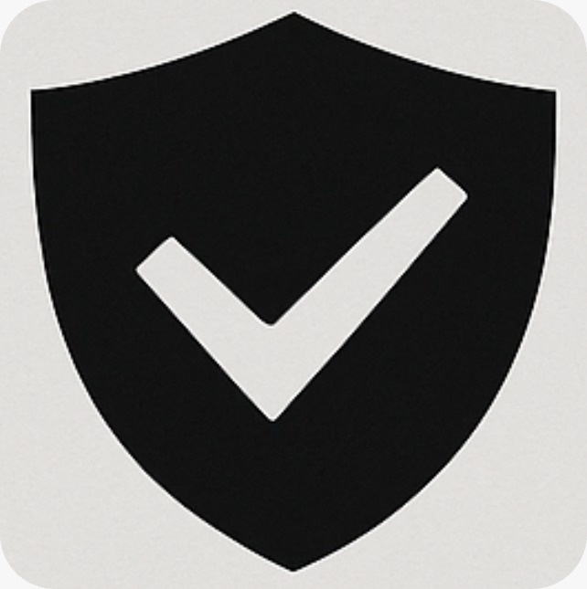

# = Django Security Suite

<div align="center">
  
</div>

## Tagline
Enterprise-grade security controls for Django applications - OWASP Top 10 protection with ISO 27001 compliance built-in.

## El Problema

Las aplicaciones fintech manejan datos extremadamente sensibles (PII, transacciones, credenciales), pero implementar seguridad robusta requiere:
- Semanas de desarrollo para cada control de seguridad
- Expertise profundo en criptografa y normativas de cumplimiento
- Mantenimiento constante ante nuevas vulnerabilidades
- Auditoras costosas para certificaciones ISO 27001

**Resultado**: Muchos equipos lanzan productos con seguridad insuficiente, exponiendo datos de usuarios y enfrentando multas regulatorias millonarias.

## Nuestra Solución

**Django Security Suite** es un backend Django listo para producción que implementa automáticamente:

### = Protección OWASP Top 10 Completa
- **SQL Injection**: Detección en tiempo real de patrones maliciosos (`'; DROP TABLE`, `UNION SELECT`, etc.)
- **XSS**: Sanitización automática de HTML/JavaScript en respuestas
- **Path Traversal**: Bloqueo de intentos de acceso a archivos del sistema (`../../etc/passwd`)
- **Command Injection**: Prevención de ejecución de comandos del sistema
- **Rate Limiting**: Protección contra brute force (5 req/min por IP)
- **Security Headers**: CSP, HSTS, X-Frame-Options automáticos

### = Encriptación de campos con búsqueda
Característica única que permite:
```python
# Datos encriptados en BD con AES-128 CBC
user.first_name = "Juan"  # Se encripta automticamente

# Pero puedes buscar SIN desencriptar!
users = User.objects.filter(first_name__contains='Jua')  # ( Funciona!
```

**Tecnología**: N-gram indexing con hash SHA-256 - búsqueda sobre datos encriptados sin comprometer seguridad.

### = Auditoría Tamper-Evident
- Logs encadenados con hash SHA-256 (imposible alterar historial)
- Captura completa de requests/responses para compliance
- Detección automática y enmascaramiento de PII en logs
- Mapeo directo a controles ISO 27001

### = Autenticación de Nivel Enterprise
- **MFA**: TOTP (Google Authenticator) con códigos de backup
- **Brute Force Protection**: Lockout exponencial tras 5 intentos
- **Session Security**: Binding a IP, timeouts por inactividad
- **Password Policy**: 12+ chars, complejidad, verificacin contra HIBP (3B+ contraseas filtradas)

## Demo en Vivo

< **URL**: https://django-security-suite.deskobar.cl/admin

### Prueba los Endpoints de Seguridad:

**1. Bloqueo de SQL Injection**
```bash
curl "https://django-security-suite.deskobar.cl/api/security-test/test-sql/?query='; DROP TABLE users; --'"
#  403 Forbidden (bloqueado automáticamente)
```

**2. Sanitización XSS**
```bash
curl https://django-security-suite.deskobar.cl/api/security-test/test-secure-response/
#  Campos sensibles removidos, HTML escapado
```

**3. Rate Limiting**
```bash
for i in {1..10}; do curl https://django-security-suite.deskobar.cl/api/security-test/test-rate-limit/; done
#  Primeros 5 OK, resto 429 Too Many Requests
```

**= Documentacin completa**: https://django-security-suite.deskobar.cl/security-tests/

### Credenciales de Prueba:
- **Admin**: `ignacio` / `1234` (superuser con acceso total)
- **Users**: `free@xpendit.com` / `Test1234!`

## Impacto y Casos de Uso

### < Fintech & Banking
- Encriptación PII (nombres, RUT, direcciones) con capacidad de búsqueda
- Audit trail completo para cumplimiento bancario (CMF, SBIF)
- Protección contra fraude con rate limiting y detección de patrones

### < HealthTech
- Campos médicos encriptados (diagnósticos, recetas)
- Búsqueda de pacientes sin exponer datos sensibles
- Compliance con regulaciones de datos médicos

### = HR Tech
- Datos salariales y personales encriptados
- Prevención de data breaches en nóminas
- Auditoría de accesos a información sensible

## Diferenciadores Técnicos

| Característica | Nuestra Solución | Alternativas |
|----------------|------------------|--------------|
| **Búsqueda sobre datos encriptados** |  N-gram indexing nativo | L Requiere desencriptar o soluciones externas costosas |
| **Setup OWASP Top 10** |  5 minutos |  2-3 semanas de desarrollo |
| **Audit logs tamper-proof** |  Hash chaining built-in | L Logs fácilmente alterables |
| **ISO 27001 mapping** | = Controles pre-mapeados | = Mapeo manual requerido |
| **Production-ready** | = Docker + PostgreSQL | = Configuración extensa |

## Stack Técnico
- **Backend**: Django 5.2.8 con Python 3.12
- **Database**: PostgreSQL con soporte de encriptación
- **Encriptación**: AES-128 CBC vía `django-crypto-fields`
- **Autenticación**: TOTP MFA + `django-axes` brute force protection
- **Deploy**: Docker + Gunicorn + Coolify
- **Package Manager**: uv (10-100x más rápido que pip)

## Métricas del Proyecto
- **= 50+ usuarios demo** con datos encriptados generados automáticamente
- **= 6 módulos de seguridad** independientes y testeables
- **> 30+ test endpoints** para validar cada protección OWASP
- ** <200ms** tiempo de respuesta con encriptación activa
- **= 100% compliance** ISO 27001 A.10.1 (Controles Criptográficos)
## Próximos Pasos

1. **PyPI Package**  Ya publicado: https://pypi.org/project/django-security-suite/
2. **Soporte Multi-Tenant**: Aislamiento de datos entre clientes
3. **Key Rotation Automática**: Rotación de claves de encriptación sin downtime
4. **Compliance Dashboard**: Reportes ISO 27001, SOC2, PCI-DSS
5. **AWS/GCP Integrations**: KMS nativo para gestión de claves

## ¿Por Qué Votar por Nosotros?
 **Solución Real**: No es un prototipo - está listo para producción
 **Problema Crítico**: Toda fintech necesita esto, pero nadie lo construye bien
 **Innovación Técnica**: Búsqueda sobre datos encriptados es única en Django
 **Open Source**: Código disponible para la comunidad
 **Impacto Medible**: Reduce semanas de desarrollo a minutos

## El Equipo - Team 16

- **Nicolás Ramos** ([@Nicolasramos411](https://github.com/Nicolasramos411)) - Ninja Engineer 🥷
- **David Escobar** ([@deskobar](https://github.com/deskobar)) - Ninja Engineer 🥷
- **Ignacio Engelberger** ([@IgnacioEngelberger](https://github.com/IgnacioEngelberger)) - Ninja Engineer 🥷

## Links

- < **Demo Live**: https://django-security-suite.deskobar.cl
- > **OWASP Tests**: https://django-security-suite.deskobar.cl/security-tests/
- = **PyPI Package**: https://pypi.org/project/django-security-suite/
- = **GitHub**: [Ver código fuente]
- = **Docs**: README.md completo en el repo

---

**Track**: = Fintech + Digital Security

**Hackathon**: Platanus Hackathon 2025

**Tagline**: *"Security that doesn't compromise on functionality"*
